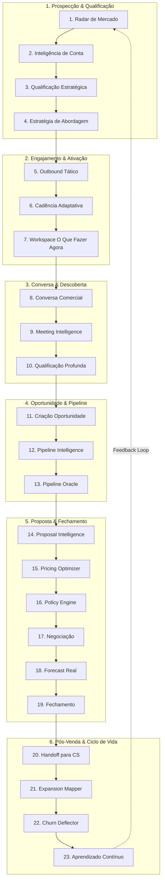

# Birth Hub 360 — Agente Comercial de Elite
## Arquitetura Ponta a Ponta com Orquestração dos 392 Agentes

- **Status:** Oficial / Especificação Arquitetural de Referência
- **Versão:** 2.0.0
- **Classificação:** Core Commercial Architecture / Autonomous Operating System
- **Domínios Envolvidos:** Intelligence Swarm, Job Roles, CRM, Outbound, Voice, Front-End, Governance

---

## 1. Visão Executiva: Da Fragmentação ao Cérebro Comercial Coletivo

O maior erro em sistemas de múltiplos agentes é transformar o catálogo em **392 botões no painel**. O usuário não quer gerenciar 392 funcionários virtuais isolados, configurar 392 prompts ou navegar por um mar de telas desconexas.

O desenho definitivo da **Birth Hub 360** unifica essa malha sob um único **Agente Comercial de Elite**.

```
                         BIRTH HUB 360
                              │
                              ▼
                    AGENTE COMERCIAL ELITE
                              │
                    ┌─────────┴─────────┐
                    │                   │
                 FRONT                 BACK
          Experiência Humana    Inteligência / Malha
         ("O Que Fazer Agora")  (Orquestração Viva)
                    │                   │
                    └─────────┬─────────┘
                              ▼
                          TAGARELA
                     Supervisor / Router
                              │
              ┌───────────────┼───────────────┐
              ▼               ▼               ▼
           GISELLE         PATRÍCIA        GUARDIÃO
          Estratégia       Execução      Governança / CRM
         & Inteligência    & Outbound       & Policy
              │               │               │
              └───────────────┼───────────────┘
                              ▼
                     AGENTES ESPECIALISTAS
                              │
              ┌───────────────┼───────────────┐
              ▼               ▼               ▼
           VENDAS         MARKETING          OPS
            107               53              76
              │
          CS / FIN / LEGAL / EXEC (156)
                              │
                              ▼
                          TOOL LAYER
                              │
       CRM · EMAIL · VOICE · WHATSAPP · CALENDAR · DATA ENRICHMENT
```

### O Paradigma: De Chat Reativo para Commercial Autonomous OS

| Dimensão | Modelo Antigo (Reativo) | Birth Hub 360 (Commercial Autonomous OS) |
| :--- | :--- | :--- |
| **Gatilho** | Usuário digita uma pergunta em um chat | **Evento de negócio** (lead novo, email aberto, deal parado, call finalizada) |
| **Comportamento** | LLM cospe texto genérico | **Percepção → Contexto → Agente → Especialistas → Decisão → Policy → Ação** |
| **Interface** | Caixa de chat com 392 botões/prompts | **Workspace "O Que Fazer Agora"** com 1 clique para executar e evidência audível |
| **Consistência** | Alucinações, prompts conflitantes | **Grafo determinístico com alçadas, RBAC e contratos estritos** |
| **Feedback Loop**| Nulo (pergunta e resposta esquecidas) | **Learning Layer que calibra persona, canal, timing e argumento por vitória/perda** |

---

## 2. A Tríade de Liderança e Governança

O supervisor central **Tagarela** não se perde em dezenas de tarefas operacionais. Ele delega diretamente para uma **Tríade de Diretores**:

```
                       TAGARELA (Supervisor Geral)
                      ┌───────────────────────────┐
                      │ Roteador de Alta Alçada   │
                      │ Context Engine & Intent   │
                      │ StateGraph Orchestrator   │
                      └─────────────┬─────────────┘
                                    │
         ┌──────────────────────────┼──────────────────────────┐
         ▼                          ▼                          ▼
    GISELLE                    PATRÍCIA                    GUARDIÃO
(VP Estratégia)             (VP Execução)            (VP Governança & Risco)
- Análise de ICP           - Cadência Multicanal      - Validação de RBAC & Alçadas
- Inteligência de Conta    - SDR Outreach             - Integridade CRM (Bitrix/Internal)
- Hipótese de Dor          - Email & WhatsApp         - Guardrail LGPD & PII Consent
- Proposta de Valor        - Cold Call & Voice Drop   - Policy Engine (Descontos/Margem)
- Estratégia de Deal       - Meeting Booking          - Detecção de Pipeline Artificial
```

1. **Tagarela (Supervisor / Router):** Implementado sobre LangGraph `StateGraph`, gerencia a memória da missão (`AgentMemory`), controla o limite de saltos (`MAX_STEPS`), invoca a Tríade e sintetiza o veredito final para o vendedor.
2. **Giselle (Estratégia & Inteligência):** Recebe o contexto bruto, aciona analistas de mercado, concorrência e persona, e entrega um **Plano de Ataque Estruturado** (Quem abordar, por qual dor, com qual proposta, em qual canal e timing).
3. **Patrícia (Execução & Operação):** Recebe o plano validado de Giselle e comanda o braço tático. Dispara mensagens personalizadas, orquestra cadências adaptativas, aciona discadores e agenda reuniões.
4. **Guardião (Governança & Risco):** Atua transversalmente. Nenhuma ação de Giselle ou Patrícia toca ferramentas externas ou persiste alterações críticas sem passar pelo crivo de alçadas, autorização RBAC e conformidade LGPD.

---

## 3. Racionalização dos 392 Agentes: Arquitetura do Catálogo

Transformar 392 definições soltas em uma pirâmide funcional de engenharia de software e inteligência:

```
                  ┌──────────────────────────────┐
                  │       ~40 AGENTES CORE       │  -> Papéis Estratégicos & Decisores
                  └──────────────┬───────────────┘
                                 │
                  ┌──────────────┴───────────────┐
                  │    ~80 AGENTES SPECIALIST    │  -> Especialistas de Domínio
                  └──────────────┬───────────────┘
                                 │
                  ┌──────────────┴───────────────┐
                  │          ~100 SKILLS         │  -> Funções Reutilizáveis de Prompt/LLM
                  └──────────────┬───────────────┘
                                 │
                  ┌──────────────┴───────────────┐
                  │   ~100 TOOLS / CAPABILITIES  │  -> Executores de I/O Determinísticos
                  └──────────────────────────────┘
```

### Exemplos Práticos de Consolidação

- **Outbound Communication:** Em vez de ter 4 agentes soltos (`EmailWriter`, `EmailPersonalizer`, `FollowUpWriter`, `ColdEmailAgent`), existe **1 Agente Especialista (`Outbound Outreach Specialist`)** equipado com **Skills parametrizáveis** (`personalize_copy`, `write_followup`, `craft_icebreaker`) rodando sobre **Tools reais** (`send_email`, `send_whatsapp`).
- **CRM Guardian:** Em vez de `CRMCleanser`, `DuplicateDetector`, `FieldValidator`, existe **1 Core Agent (`CRM Guardian`)** operando capabilities determinísticas (`crm.deduplicate`, `crm.validate_fields`, `crm.normalize_cnpj`).
- **Pipeline & Forecast:** Em vez de 8 variações de forecast, opera o **Pipeline Oracle** consumindo a skill `deal_velocity_analysis` e a tool `pipeline.fetch_cohort_metrics`.

---

## 4. As 23 Etapas da Jornada Comercial Ponta a Ponta



### Detalhamento das 23 Fases

| # | Fase | Agentes / Especialistas Envolvidos | Entradas (Inputs) | Saídas (Outputs) & Formato | Guardrail & Policy |
| :--- | :--- | :--- | :--- | :--- | :--- |
| **01** | **Radar de Mercado** | Lead Hunter, Market Intel, ICP Analyst, Territory Intel, Intent Detector | CNAE, região, frota, tecnologia, notícias, vagas | 30-50 contas quentes com evidências de disparo | Minimização LGPD; rejeitar listas compradas sem base legal |
| **02** | **Inteligência de Conta** | Account Intelligence, Contact Mapper, Buying Committee Mapper, Competitor Intel | CNPJ, domínio, LinkedIn, site, histórico CRM | **Account Intelligence Pack** (Decisores, Techs, Dores Prováveis) | Sanitização PII, sem scrapers ilegais |
| **03** | **Qualificação Estratégica** | Qualification Agent, ICP Scorer, Fit Analyzer, Opportunity Scorer | Account Pack + critérios do ICP da organização | Scores explicáveis com `reason`, `evidence` e `confidence` | **Score nunca inexplicável**; transparência algorítmica |
| **04** | **Estratégia de Abordagem** | Giselle, Persona Strategist, Messaging Strategist, Value Proposition | Persona + Dores detectadas + Sinais de mercado | **Plano Estratégico:** Objetivo, Dor, Ângulo, Proposta, Canal, CTA | Proibido mensagens genéricas de IA ("espero que este email o encontre bem") |
| **05** | **Outbound Tático** | Patrícia, SDR Outreach, Email Personalizer, LinkedIn Agent, Meeting Booker | Plano aprovado de Giselle | Cadência Multicanal (D1, D2, D4) + Copys personalizadas | Rate limits por domínio/caixa, SPF/DKIM check |
| **06** | **Cadência Adaptativa** | Next Best Action Agent, Cadence Optimizer | Eventos em tempo real (email aberto 4x, call não atendida) | Gatilho dinâmico imediato: *"Ligar hoje 10h-11h30"* | Não inundar o lead; respeitar horários comerciais |
| **07** | **Workspace do Vendedor** | Agente Comercial Elite (Front Orchestrator) | Dados agregados do CRM + Recomendações NBA | **Card de Ação:** ACME Logística, Ação sugerida, Motivos, Botão Executar | Ação com 1 clique; nunca obrigar preenchimento redundante |
| **08** | **Conversa Comercial** | Voice/STT, Conversation Intelligence, Objection Handling, Discovery Coach | Stream de áudio da chamada telefônica / WebRTC | Batalhas de objeção em tempo real + perguntas recomendadas na tela | Consentimento de gravação em conformidade com a lei |
| **09** | **Meeting Intelligence** | Meeting Summarizer, Action Extractor, Risk Detector, CRM Sync | Transcrição completa da reunião de vídeo/call | Resumo executivo, dores, prazos, riscos e payload para CRM | Vendedor valida antes de consolidar (`[Confirmar no CRM]`) |
| **10** | **Qualificação Profunda** | MEDDICC Agent, BANT Agent, SPICED Agent | Fatos da reunião + interações históricas | Grid simplificado: Dor, Impacto, Decisor, Champion, Budget, Timing | O vendedor vê status direto, nunca termos técnicos acadêmicos |
| **11** | **Criação de Oportunidade**| Opportunity Builder, Deal Intelligence, Deal Risk | Lead qualificado com evidência de compra | Oportunidade criada com MRR, produto, forecast, riscos e stakeholders | Não criar deal fantasma; exige decisor ou reunião realizada |
| **12** | **Pipeline Intelligence** | Pipeline Auditor, Bottleneck Detector, KPI Analyst | Snapshot do CRM, tempo de estágio, histórico de atividade | Classificação de saúde: `HEALTHY`, `ATTENTION`, `RISK`, `STALLED` | Identificar gargalos operacionais e perda de velocidade |
| **13** | **Pipeline Oracle** | Pipeline Oracle, Cohort Analyzer, Pipeline Cleanse | Volume de deals, aging, recência de contatos | Forecast discriminado: Total vs. Elegível vs. Commit vs. Fake inflado | Expor inflações artificiais de meta para o gestor |
| **14** | **Proposal Intelligence** | Proposal Agent, Product Matcher, Commercial Terms | Diagnóstico de dor + catálogo de produtos/serviços | Proposta comercial hiper-personalizada com escopo e valores | Paridade de preços do catálogo oficial |
| **15** | **Pricing Optimizer** | Pricing Optimizer, Margin Guard | Ticket, margem, porte, volume, concorrência | Recomendação de tabela de preços e faixa segura de desconto | Alçada de desconto vinculada estritamente ao cargo |
| **16** | **Policy Engine** | Guardian, RBAC Engine, Approval Policy Engine | Ação pretendida (ex: desconto de 18%) | Veredito: Aprovado automaticamente ou Rota de Alçada exigida | **Fail-Closed**: sem permissão comprovada, a ação trava |
| **17** | **Negociação** | Negotiation Agent, Battlecard Agent, Legal Risk | Minuta, contraproposta do cliente, termos contratuais | Pontos de concessão, defesas de valor e riscos de cláusula | Conformidade jurídica e preservação de margem |
| **18** | **Forecast Real** | Forecast Intelligence, Bayesian Deal Predictor | Sinais comportamentais + recência + sentimento | Previsão ponderada probabilística real de fechamento | Nunca se apoiar em probabilidades fixas de etapa |
| **19** | **Fechamento** | Contract Agent, Billing Agent, Implementation Agent | Evento `deal.won` comprovado | Minuta gerada, link D4Sign/DocuSign enviado, ordem faturamento | Proibido marcar como ganho sem evidência contratual |
| **20** | **Handoff para CS** | Customer Brief Generator, Onboarding Orchestrator | Histórico completo de vendas, promessas, dores, escopo | **Customer Brief** completo entregue para o time de CS | O cliente nunca precisa repetir para CS o que disse em vendas |
| **21** | **Expansion Mapper** | Expansion Mapper, Cross-sell Engine | Métricas de uso do produto, novas filiais, novas dores | Oportunidades identificadas de Upsell e Cross-sell | Timing correto baseado em valor já entregue |
| **22** | **Churn Deflector** | Churn Deflector, Health Score Sentinel | Queda de engajamento, tickets de suporte, NPS baixo | Alerta de risco e playbook de resgate imediato acionado | Devolve o contato ao Comercial quando há risco comercial |
| **23** | **Aprendizado Contínuo** | Learning Agent, Event Bus Analytics | Resultados reais de vitória/perda, taxas de conversão | Perfil de estilo e parâmetros de abordagem refinados | **Gate de Aprovação Humana**: IA não altera regras operacionais sozinha |

---

## 5. Front-End: A Experiência Unificada do Vendedor

O front-end do **Agente Comercial de Elite** substitui a complexidade de dashboards analíticos passivos por uma interface orientada à decisão ativa.

```
┌─────────────────────────────────────────────────────────────────────────────────────────────┐
│ 🧠 AGENTE COMERCIAL DE ELITE                                              [Status: Ativo 🟢]│
├─────────────────────────────────────────────────────────────────────────────────────────────┤
│ META DO MÊS           FECHADO             GAP                 PIPELINE ELEGÍVEL             │
│ R$ 420.000            R$ 268.000          R$ 152.000          R$ 734.000                    │
│ [██████████████░░░░] 63.8%                                    Commit: R$ 390K               │
├─────────────────────────────────────────────────────────────────────────────────────────────┤
│ 🎯 O QUE FAZER AGORA (Prioridade Máxima)                                                    │
│                                                                                             │
│ 🏢 ACME Logística S/A                       Opportunity Score: 91/100 🟢                    │
│ Contato: Carlos Mendes (Diretor de Operações)                                               │
│                                                                                             │
│ 📞 Ação: Ligar agora (Janela ótima: 10h00 - 11h30)                                          │
│                                                                                             │
│ Motivos e Evidências:                                                                       │
│ • ICP Score 96 (Frota 85 veículos, expansão regional detectada)                             │
│ • Abriu a proposta comercial 4 vezes nas últimas 24h                                        │
│ • 3 dias sem contato do vendedor responsável                                                │
│ • Concorrente mencionado: Senior Sistemas (Battlecard pronto)                               │
│                                                                                             │
│ [ 📞 LIGAR AGORA VIA BIRTHUB VOICES ]    [ 📝 VER PROPOSTA ]    [ ⏭️ PULAR COM JUSTIFICATIVA ]│
├─────────────────────────────────────────────────────────────────────────────────────────────┤
│ ⚡ AGENT CENTER: EXECUÇÃO VIVA DA MALHA (Missão: ACME Logística)                             │
│                                                                                             │
│ 🌲 Tagarela (Supervisor Geral)                                                              │
│    ├── 🧠 Giselle (Estratégia)                                                              │
│    │   ├── ✓ ICP Analyst (Score 96 - Enquadramento Ideal)                                   │
│    │   ├── ✓ Account Intelligence (Decisor mapeado via Receita/LinkedIn)                    │
│    │   └── ✓ Competitor Battlecard (Gatilho de diferenciação carregado)                     │
│    ├── ⚡ Patrícia (Execução)                                                               │
│    │   ├── ✓ Email Personalizer (Entregue em 16/09 às 09:15)                                │
│    │   └── ⏳ Next Best Action (Disparo de ligação telefônica recomendado)                  │
│    └── 🛡️ Guardião (Governança)                                                             │
│        └── ✓ Policy Engine (Sem pendências de alçada ou risco de compliance)                │
└─────────────────────────────────────────────────────────────────────────────────────────────┘
```

---

## 6. Governança e Regras de Segurança

1. **Transparência de Score Obrigatória:** Todo score comercial (`ICP`, `Fit`, `Intent`, `Opportunity`) gerado pela malha deve obrigatoriamente retornar a tupla `{ score: number, reason: string, evidence: string[], confidence: number }`.
2. **Fail-Closed no Policy Engine:** Toda tentativa de ação que envolva precificação, desconto, envio de proposta ou concessão de acesso que não possua autorização explícita é bloqueada e encaminhada para a esteira de aprovação humana.
3. **Guardrails de PII & LGPD:** Antes de qualquer payload ser enviado a provedores externos de LLM, o método `assertPiiExternalConsent()` higieniza dados sensíveis e garante a vigência da base legal.
4. **Isolamento Multi-Tenant:** Toda execução de agente, memória persistida e tool use opera com escopo restrito ao `tenantId` da requisição através de RLS no PostgreSQL.

---

## 7. Mapeamento Técnico com o Código-Fonte Existente

A arquitetura se conecta diretamente às estruturas já consolidadas no repositório:

| Componente da Arquitetura | Módulo no Repositório | Status Técnico |
| :--- | :--- | :--- |
| **Supervisor Tagarela** | `src/features/intelligence/agents/supervisor.agent.ts` | Expandir o LangGraph `StateGraph` de 5 nós para os nós mestres da Tríade (`giselle`, `patricia`, `guardiao`). |
| **Contrato de Saída & Handoff**| `src/features/intelligence/agents/commercialAgentTypes.ts` | Padronizado com `AgentExecutionResult` e `AgentHandoff`. |
| **Barramento de Agentes** | `src/features/job-roles/services/agentBus.service.ts` | Roteamento de mensagens inter-agentes com proteção contra loop. |
| **Motor de Autorização & Capabilities** | `src/features/job-roles/services/capabilityAuthorization.service.ts` | Validação determinística de alçadas e permissões. |
| **Executores de Ferramentas (Tool Layer)**| `src/features/job-roles/services/toolExecutors.ts` | Chamadas reais aos serviços de CRM, Bitrix, Email, WhatsApp e Voz. |
| **Catálogo de 392 Agentes** | `src/features/job-roles/catalog/agents.normalized.json` | Base canônica importada para vincular como Core, Specialist ou Skill. |
| **Ações Pendentes de Decisão**| `AIPendingAction` / `src/features/intelligence/agents/opsPendingActions.tool.ts` | Esteira de aprovação humana para ações de alto risco. |
| **Memória Persistente** | `AgentMemory` no Prisma / `src/features/intelligence/agents/agentMemory.store.ts` | Histórico e aprendizado por agente, tenant e lead. |
